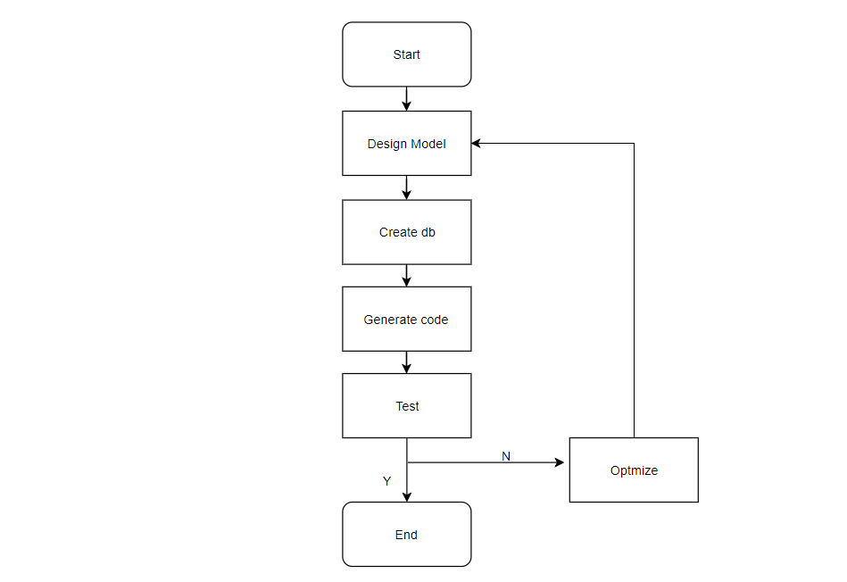

# EZLinker开发文档
开发流程：
[](resources/static/1.png)

## 1.数据库规范
### 1.1 Mysql表结构规范
新建表的时候需要遵守规范,基础表结构如下:

```sql
CREATE TABLE `表名` (
  `id` int unsigned NOT NULL AUTO_INCREMENT COMMENT 'PK',
  `record_version` int NOT NULL DEFAULT '0' COMMENT '记录版本',
  `x` tinyint(1) unsigned zerofill NOT NULL COMMENT '是否删除',
  `create_time` datetime NOT NULL COMMENT '创建时间',
  PRIMARY KEY (`id`) USING BTREE
) ENGINE=InnoDB AUTO_INCREMENT=0 DEFAULT CHARSET=utf8mb4 COLLATE=utf8mb4_general_ci ROW_FORMAT=DYNAMIC COMMENT='产品（设备的抽象模板）';
```
### 1.2 Mysql表名规范
1. 配置表全部`config`结尾.
2. 表名全部是常见名词的单数形式,意义要明确,不可出现`do object my`等模棱两可的名称.
3. 表名用名词单数形式,比如User,Student;
4. 中间关系表用 `relation`开头,后面跟关联的主表,从表,比如用户和博客的关系表:`relation_user_blog`,统一放进relation模块.
## 2. EZLinker框架的使用
### 2.1 包名规范
1. controller:WEB控制器;
2. model:数据模型;
3. mapper:MyBatis映射;
4. service:Service层;
5. pojo:普通的Java类,一般起辅助作用;
6. form:前端的Form表单接收;
7. utils:模块私有工具代码;
8. resource:模块私有资源文件,例如配置.

### 2.2 框架内置类
1. CurdController:有统一CURD业务场景时继承;
2. XController:简单接口继承

### 2.3 统一返回结果
- R:封装的返回值
```json
{
    "id": "d4dc62783ea548b08a30ab9303ebf421",
    "appName": "ezlinker",
    "code": 200,
    "message": "Operation success",
    "i18nMessage": "操作成功",
    "data": {}
}
```

### 内置函数
CurdController内置了一些便捷方法来获取当前的用户信息，拦截请求，参数检查等等:
1.检查Model是否为null:
```shell script
void checkModelNull(XEntity entity) throws BadRequestException
```
其中Entity是要检查的实体.

2.检查权限
```shell script
 boolean checkResourceAuthorize(IResourceAuthorizeService iResourceAuthorizeService, Long masterId, Long slaverId) 
```
主要用在用户需要操作某个资源的时候，需要检查权限.

3.快捷分页
```shell script
 IPage<T> p(Integer current, Integer size)
```
current、size对应了分页的数据和页码。

4.查询辅助
```shell script
 QueryWrapper<T> q()
```

快速取得一个SQL条件构造器

## 3. MongoDB的使用
mongodb主要用来保存大量非核心重要业务数据，使用方法：

### 3.1 索引规范
> 注意：Mongodb在使用过程中必须创建索引，不然性能十分低下。

#### 3.1.1 Mongodb创建索引脚本
```shell script
//
db.getCollection("集合名").createIndex({
    node: NumberInt("类型")
}, {
    name: "索引名称"
});
```

目前版本的索引创建:
```shell script
db.getCollection("emqx_running_log_emqx@127.0.0.1").createIndex({
    node: NumberInt("-1")
}, {
    name: "emqx_running_log_index"
});
//
db.getCollection("jvm_state").createIndex({
    node: NumberInt("-1")
}, {
    name: "jvm_state_index"
});
//
db.getCollection("system_event_log").createIndex({
    node: NumberInt("-1")
}, {
    name: "system_event_log_index"
});
//
db.getCollection("system_network_state").createIndex({
    node: NumberInt("-1")
}, {
    name: "system_network_state_index"
});
//
db.getCollection("system_os_state").createIndex({
    node: NumberInt("-1")
}, {
    name: "system_os_state_index"
});
//
db.getCollection("user_login_log").createIndex({
    node: NumberInt("-1")
}, {
    name: "user_login_log_index"
});

```
## 4.代码生成器
代码生成器位于:
```shell script
ezlinker\app\src\test\java\com\ezlinker\app\CodeGenerator.java
```
使用过程中如需切换数据库，直接修改参数即可:
```shell script
private static String AUTHOR = "wangwenhai";
private static String IP = "112.74.44.130";
private static String PORT = "3306";
private static String DB_NAME = "ezlinker";
private static String USER = "easylinker";
private static String PASSWORD = "123456";
private static String PROJECT = "app";
private static String TABLE_PREFIX = "ez_";
```