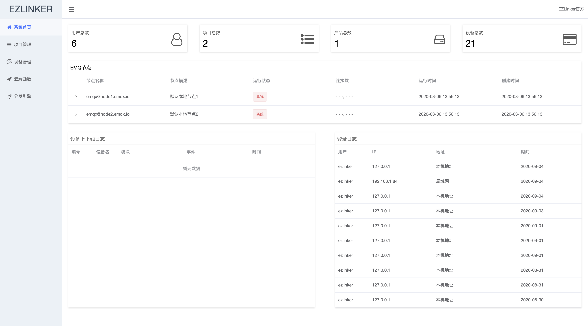
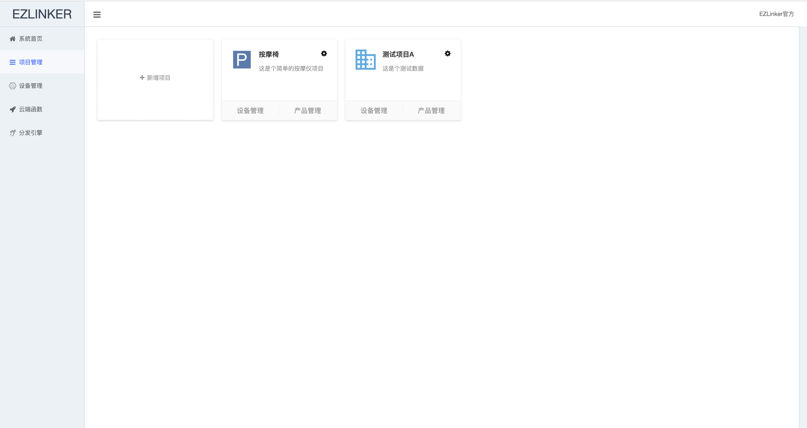
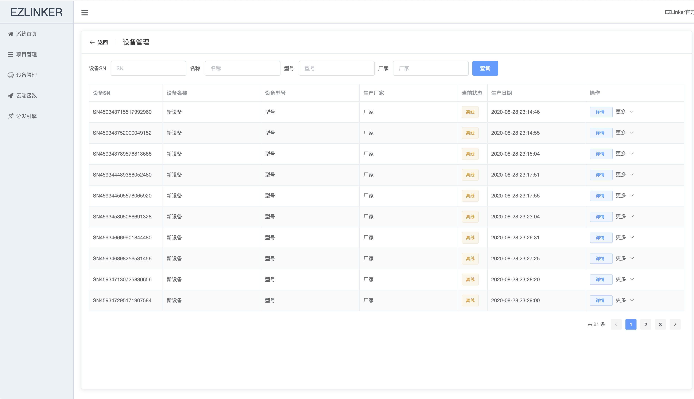
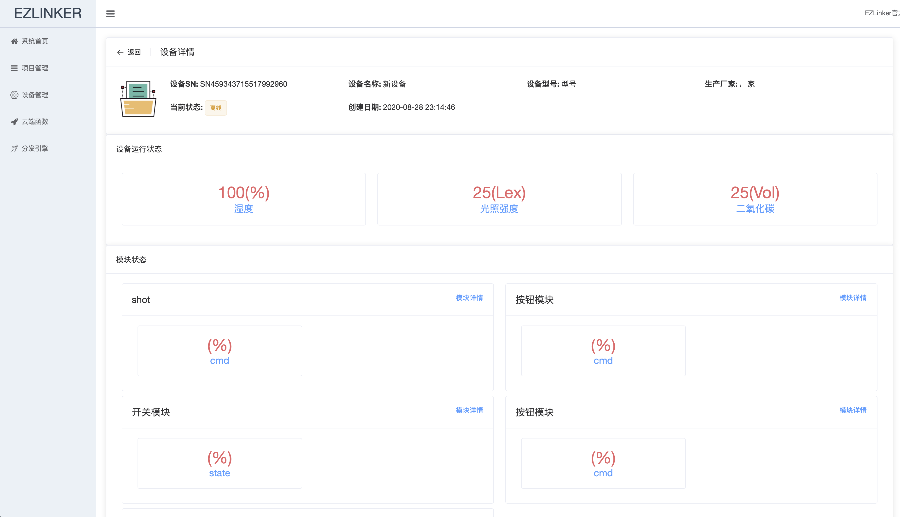
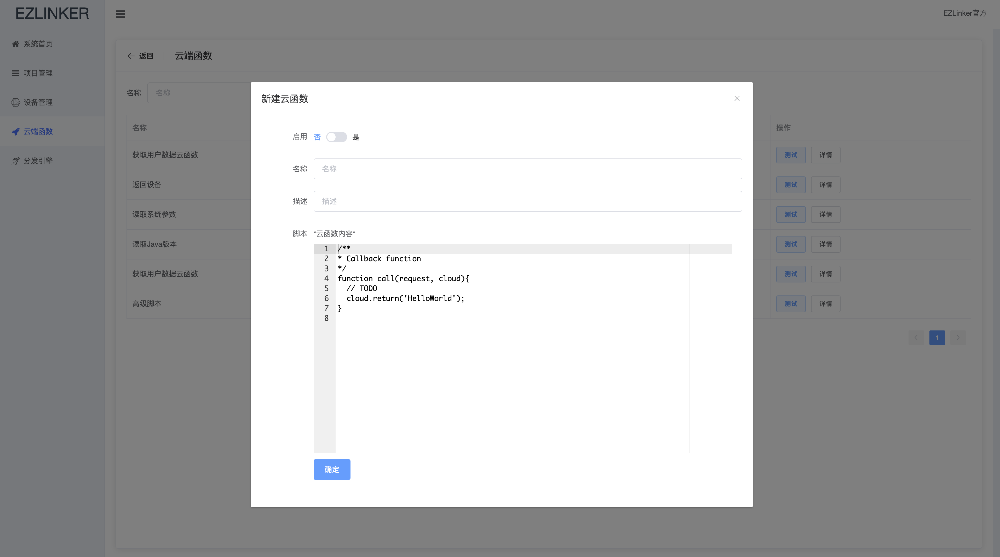

# EZLinker:一个简单易用的物联网设备管理系统
---
[](resources/static/banner.gif)
## 基本界面展示

[](resources/static/2.png)
--
[](resources/static/3.png)
--
[](resources/static/4.png)
--
[](resources/static/5.png)
--
[](resources/static/6.png)
--
[](resources/static/7.png)
--

## 当前进度
- 0I===========================60%=============I100
> 今天是2020年8月16日，本项目还在龟速前进。
> 目前还在填坑,问题很大.不建议尝试.学习可以。
> 如果有能力开发，可联系QQ：751957846;或者QQ群:475512169.

## 技术栈
主业务系统:Springboot+MyBatisPlus+Mongodb+redis
> 本项目涉及到的技术点比较多,可以插件化灵活配置.虽然比较复杂,但是后期会出详细文档和视频讲解.
## 前端地址
https://github.com/wwhai/ezlinker-frontpage
> 前端项目基于Ant Design.

## 项目文档
http://www.ezlinker.cn
> 项目详细文档,包含开发,运行.
## EMQX 相关
EZLinker的核心业务:MQTT服务,是基于EMQX构建.为了适应自己的业务场景,对EMQX做了部分二次开发,同时做了部分适配插件.
1. EZLinker团队维护的EMQX:https://gitee.com/wwhai/emqx
2. EZLinker的EMQX发行版地址:https://gitee.com/wwhai/emqx-rel
3. EZLinker核心插件:https://gitee.com/wwhai/ezlinker_core_plugin
4. EZLinker客户上下线插件:https://gitee.com/wwhai/ezlinker_advisory_plugin.git


## 其他
下面是一些辅助性的工具,还有EZLinker团队提供的常见的平台的SDK.
- Arduino SDK :https://github.com/wwhai/ezlinker_arduino_sdk.git
- ESP8266简单Demo:https://github.com/wwhai/ESP8266_Simple_cli.git

# 运行步骤
1. git 或者IDE直接导入代码；
2. 等待依赖安装成功以后，配置好Mysql(8.0+),MongoDB(4.0+)，Redis(5+)
3. 指定配置文件，然后启动

> maven项目的基本姿势
## QQ群\WeChat
[](resources/static/contract.gif)
> 加微信请注明来自github

## 协议
本项目采取Apache2开源协议.
```text
Copyright [2020] [name of copyright ezlinker]

Licensed under the Apache License, Version 2.0 (the "License");
you may not use this file except in compliance with the License.
You may obtain a copy of the License at

    http://www.apache.org/licenses/LICENSE-2.0

Unless required by applicable law or agreed to in writing, software
distributed under the License is distributed on an "AS IS" BASIS,
WITHOUT WARRANTIES OR CONDITIONS OF ANY KIND, either express or implied.
See the License for the specific language governing permissions and
limitations under the License.
```