# EZLinker:一个简单易用的物联网设备管理系统
---
## 基本界面展示
[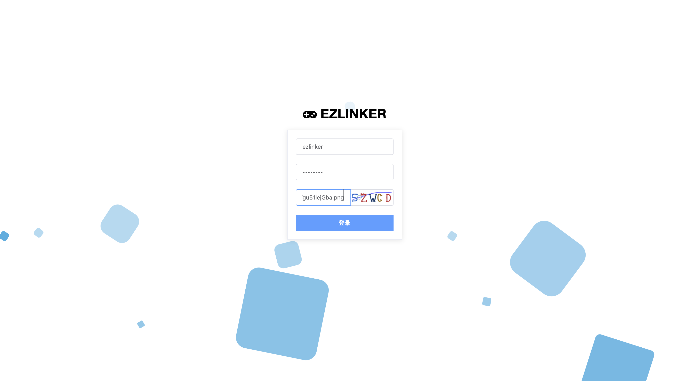](resources/static/pic/1.png)
[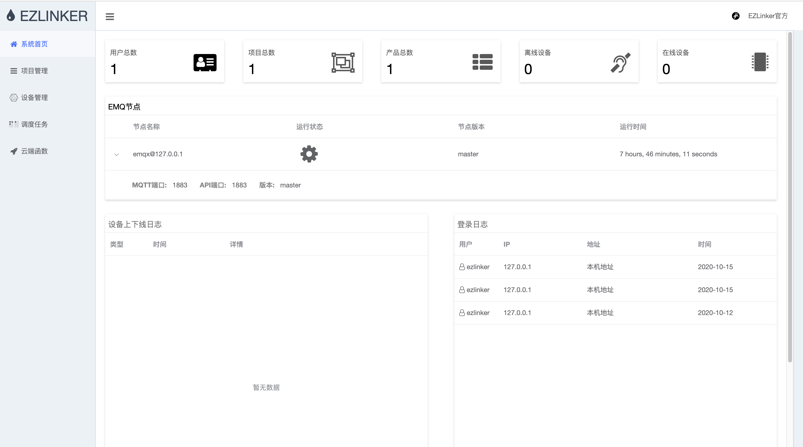](resources/static/pic/2.png)
[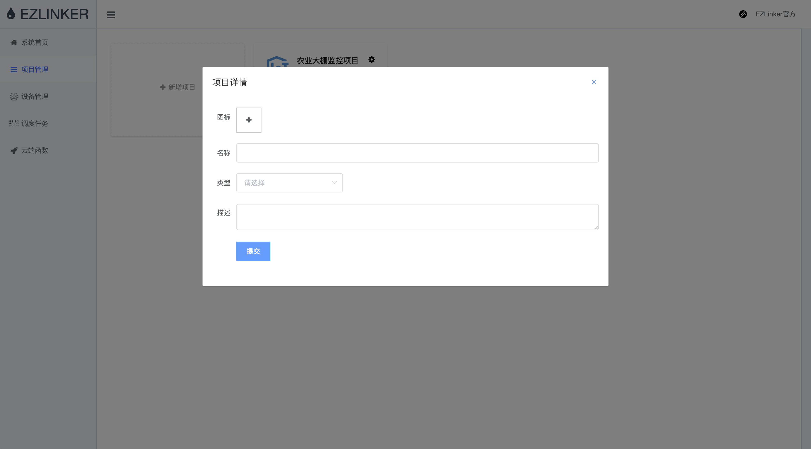](resources/static/pic/3.png)
[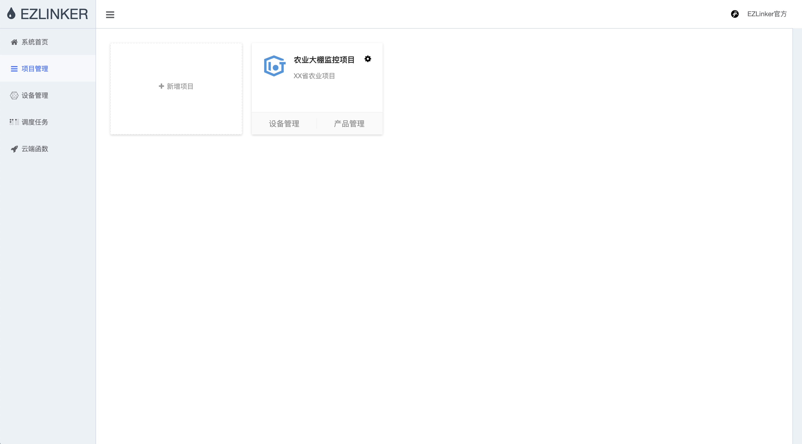](resources/static/pic/4.png)
[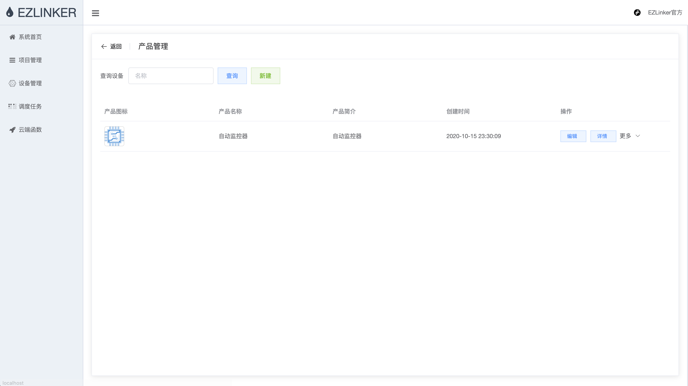](resources/static/pic/5.png)
[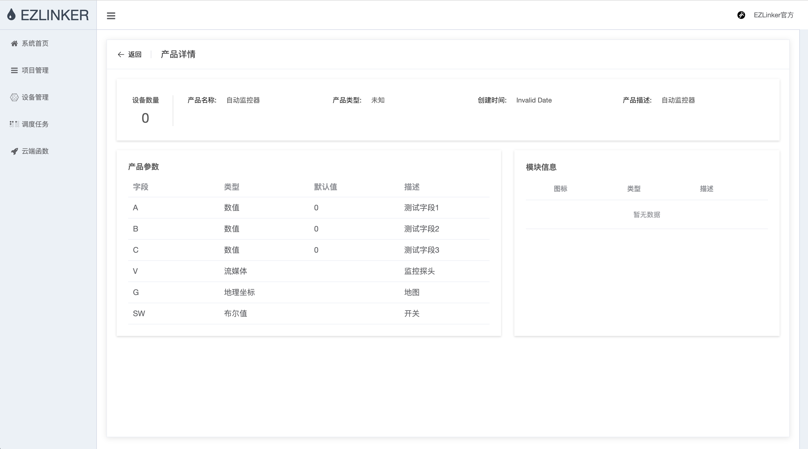](resources/static/pic/6.png)
[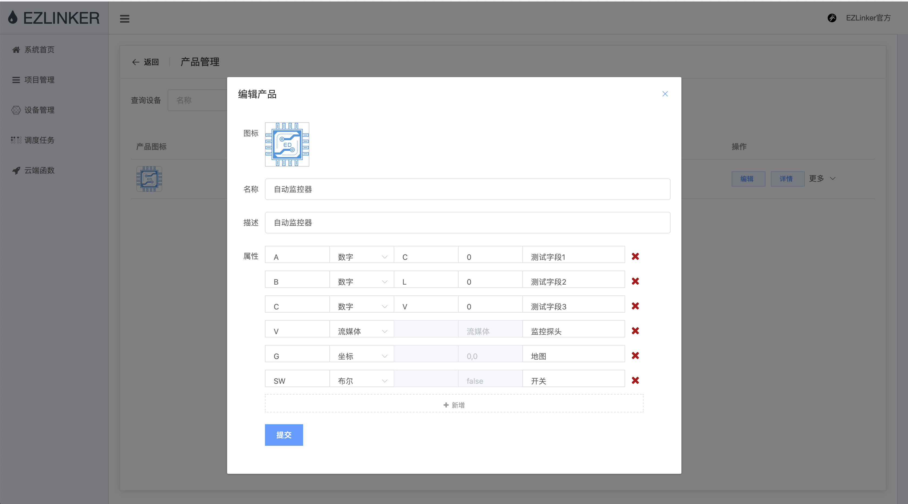](resources/static/pic/7.png)
[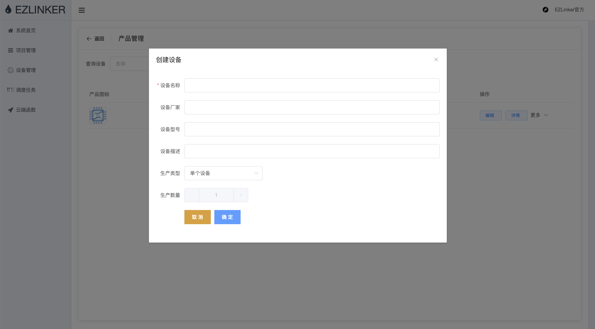](resources/static/pic/8.png)
[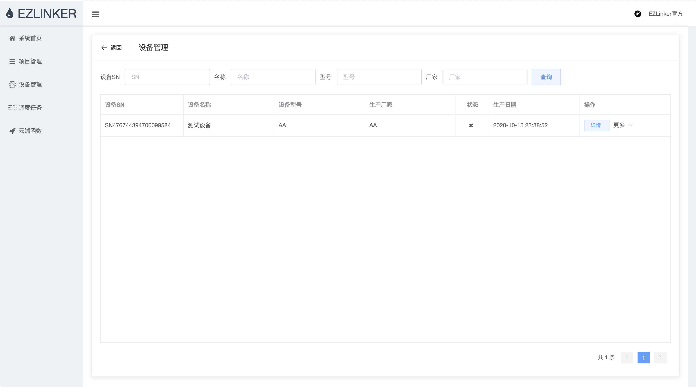](resources/static/pic/9.png)
[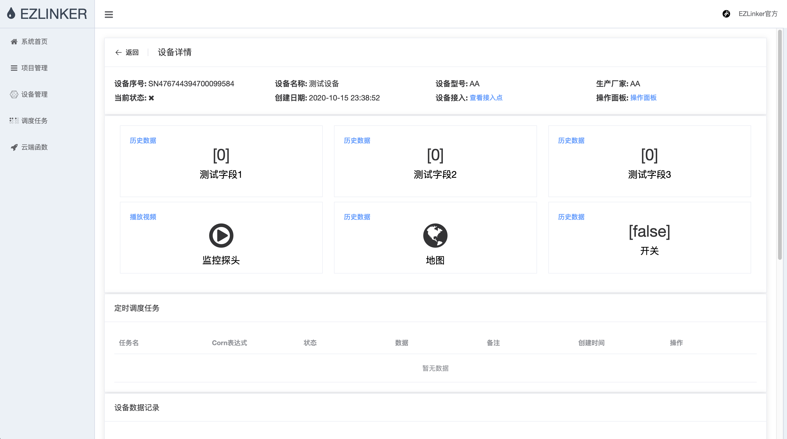](resources/static/pic/10.png)
[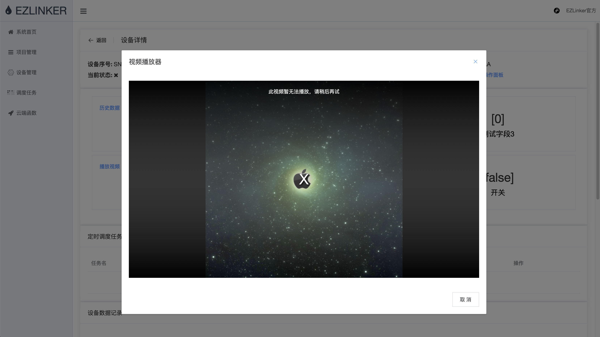](resources/static/pic/12.png)
[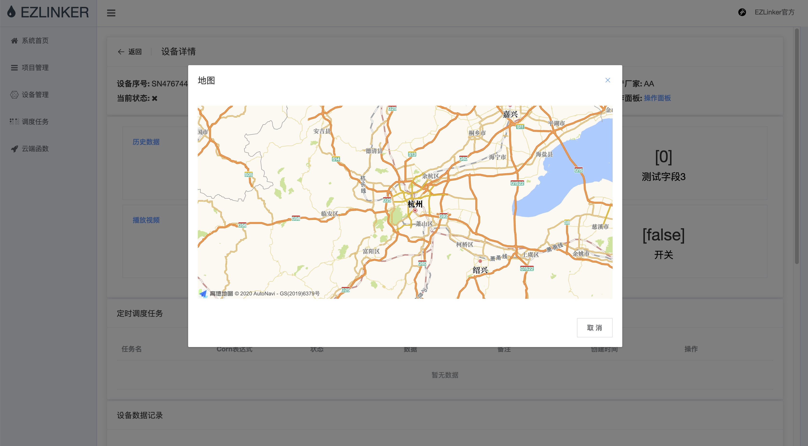](resources/static/pic/13.png)
[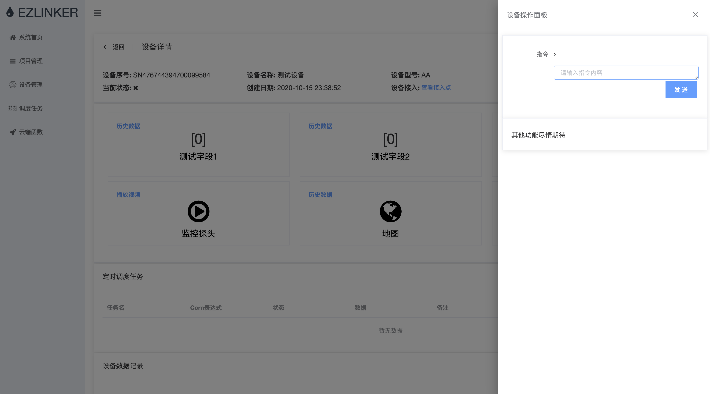](resources/static/pic/14.png)

--

## 当前进度
- 0I=============================70%========I100
> 今天是2020年10月16日，本项目还在龟速前进。
> 目前还在填坑,问题很大.不建议尝试.学习可以。
> 如果有能力开发，可联系QQ：751957846;或者QQ群:475512169.

## 前端地址
https://github.com/wwhai/ezlinker-frontpage

```shell
npm install 
npm run dev
```

## 项目文档
http://www.ezlinker.cn

## QQ群\WeChat
[](resources/static/contract.gif)
> 加微信请注明来自github

## 协议
本项目采取Apache2开源协议:http://www.apache.org/licenses/LICENSE-2.0.